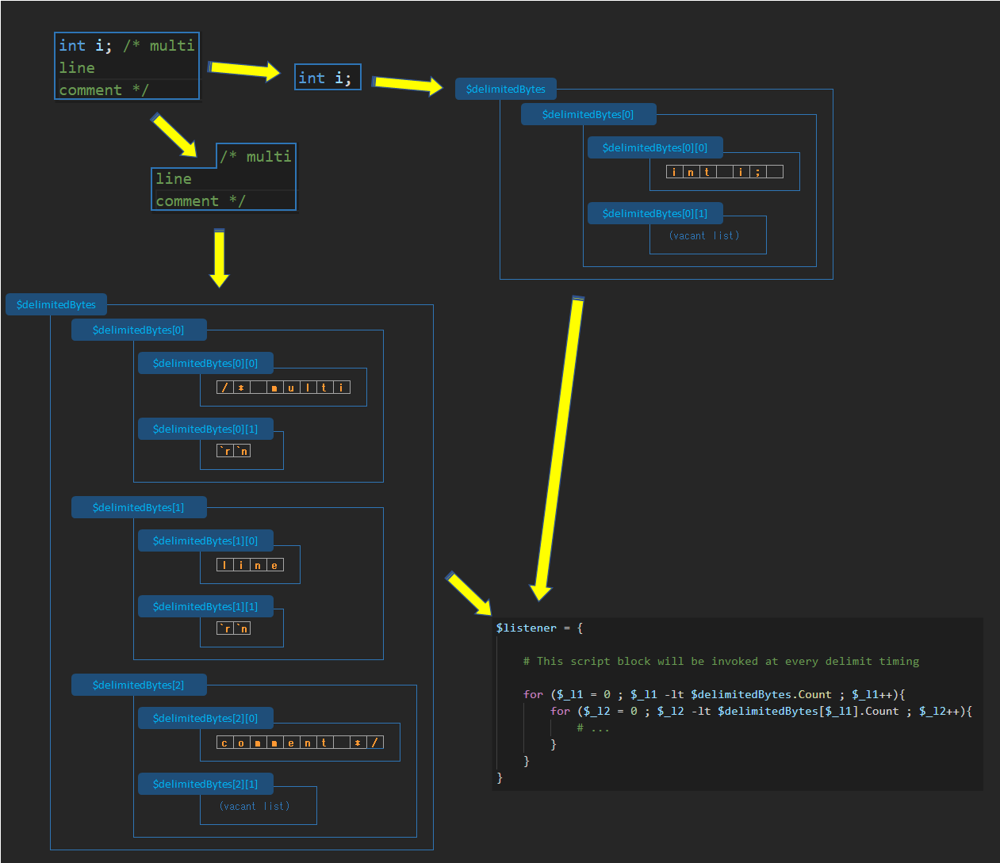
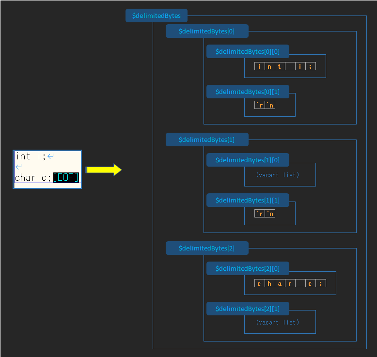

Detect the following strings from source code and convert it to byte array,  
and call specified script blck.

 - `//` comment  
 - `/* */` comment  
 - Character string enclosed in `'` or `"`  
 - Other than those above  

You can try `example.ps1 example.c` command after pulling this repository.  
This `example.ps1` script extracts only comments and output to `example_comment.c`.

# Usage

## 1. Define the script block

Define the script block that handles code strings and comment strings.  
This script block will be called every time a `//` Comment, `/* */` Comment or other is detected.  

For example, `example.ps1` implemented as follows.  

```powershell
$listener = {

    # 1. Show progress on prompt
    $percentage = ($progress[1] / $progress[0].Length) * 100
    Write-Host -NoNewline ("`r" + $percentage.ToString("0").PadLeft(3) + '% processing ' + $to_lex_file)

    # 2. Get string from $delimitedBytes that stores analized byte list.
    $sb = Stringify

    $rep = $sb -replace "[^`r`n]", '' # delete all strings without new line character

    # 3. Evaluate the type of detection
    if ( ($typeFlags[1] -band (1) ) -eq 1 ){ # Detection type represents `Code`

        $code_only_file.Write($sb)
        $comment_only_file.Write($rep)

    } else { # Detection type represents `Comments`

        $code_only_file.Write($rep)
        $comment_only_file.Write($sb)
    }
}

```

### 1. Show progress on prompt
Before of calling this script block,  
`$progress[0]` and `$progress[1]` is generated according to the progress status.  
`$progress[0]` is `System.IO.FileInfo` object of analyzing file specified.  
`$progress[1]` is number of bytes analyzed.

### 2. Get string from $delimitedBytes that stores analized byte list.

`$delimitedBytes` is also generated before calling this script block.  
`$delimitedBytes` has array list and its each element stores byte array of read line and byte array of new line character(s).  
For convert this `$delimitedBytes` to strings,   
call `Stringify` function (this is defined in `CommentLexer.ps1`) and you can get generated string as returnd value.  
If you want to extract strings for each line from `$delimitedBytes`, you have to implement manualy like as follows.  

note) `$enc` in following code is `Text.Encoding` object of encoding specified.  
`$enc` is also generated before calling this script block.  

```powershell
for ($_l1 = 0 ; $_l1 -lt $delimitedBytes.Count ; $_l1++){
    for ($_l2 = 0 ; $_l2 -lt $delimitedBytes[$_l1].Count ; $_l2++){
        if ($delimitedBytes[$_l1][$_l2].Count -gt 0){
            $_tmpstr = $enc.GetString($delimitedBytes[$_l1][$_l2])
            Write-Host $_tmpstr
        }
    }
}
```

### 3. Evaluate the type of detection

`$typeFlags[0]` and `$typeFlags[1]` is also generated before calling this script block.  
Each element of `$typeFlags` stores detection type as int value and its each bit represents detailed.  
First bit of `$typeFlags[1]` represents detection type is **not** `Comment`.  
So if `( ($typeFlags[1] -band (1) ) -eq 1 )` represents truthy, it means detection type is **not** comment.  


## 2. Import CommentLexer.ps1 as dot source

Place `CommentLexer.ps1` anywhere you like and import it as dot source.  
Following example imports `CommentLexer.ps1` placed in the same directory.  

```powershell
. .\CommentLexer.ps1
```

## 3. Call `LexComment` function

Call `LexComment` function with 3 arguments.  

```powershell
LexComment ($filePath) ($encoding) ($delimitionListener)
```

 - `$filePath`  
   
   Path of file to analyze

 - `$encoding`  
   
   Code page of text encoding of file to analyze. This argument will be used as an argument to the `System.Text.Encoding.getencoding` method.  
   Forexample, to specify UTF-8 encoding, you can specify `utf-8` as string or `65001` as integer.  
   To see the list of supported code pages instantly, execute the following powershell script.

```powershell
&{
    for($cnt = 0; $cnt -lt 65535; $cnt++){
        try{
            $enc = [Text.Encoding]::GetEncoding($cnt)
            $web_name = $enc.WebName
            $enc_name = $enc.EncodingName
            Write-Output "$cnt, $web_name, $enc_name"
        } catch {}
    }
}
```

 - `$delimitionListener`  
   
   Script block that handles detected strings.  


# Properties and functions accessible within specified script block

 - `$progress[0]`  
  
     `System.IO.FileInfo` object of specified file  

 - `$progress[1]`  
      
      Delimited byte point

 - `$typeFlags[0]`  

      Each bit represents detailed detection type of **other than** comment strings.  
      Here is meanings of each index number of bits (0 based).  
      `1` means truthy, `0` means falsy.  

|                2                 |                1                 |                  0                  |
| :------------------------------: | :------------------------------: | :---------------------------------: |
| Character string enclosed in `"` | Character string enclosed in `'` | detection type is **not** `Comment` |

 - `$typeFlags[1]`  
  
      Each bit represents detailed detection type of comment strings.  
      Here is meanings of each index number of bits (0 based).  
      `1` means truthy, `0` means falsy.  

|        2        |      1       |              0              |
| :-------------: | :----------: | :-------------------------: |
| `/* */` Comment | `//` Comment | detection type is `Comment` |

 - constant values  
   Use to evaluate `$typeFlags` instantly and safely.

| name               | value |       comment       |
| :----------------- | ----: | :-----------------: |
| TYP_CLEAR          |   0x0 |                     |
| TYP_CODE           |   0x1 | for `$typeFlags[0]` |
| TYP_CODE_QUOTE     |   0x3 | for `$typeFlags[0]` |
| TYP_CODE_DQUOTE    |   0x5 | for `$typeFlags[0]` |
| TYP_COMMENT        |   0x1 | for `$typeFlags[1]` |
| TYP_COMMENT_SINGLE |   0x3 | for `$typeFlags[1]` |
| TYP_COMMENT_MULTI  |   0x5 | for `$typeFlags[1]` |

 - `$delimitedBytes`  
  
   Detected string. This has array list and its each element stores byte array of read line and byte array of new line character(s).  
   Forexample, source code string ``int i;`r`n`r`nchar c;`` has detected, the following byte array is stored in `$delimitedBytes`.  
   `$delimitedBytes[x][0]` stores byte array of read line, `$delimitedBytes[x][1]` stores byte array of new line character(s).  
   So `$delimitedBytes[1][0]` in following example stores vacant list. ( `$delimitedBytes[1][0].Count` will return `0`)  
   


 - `Stringify`  
  
   Convert `$delimitedBytes` to string  

 - `$enc`  
  
   `Text.Encoding` object of encoding specified as 2nd argument of `LexComment` function.  

# Requirement

Powershell 2.0 or higher  

# Limitation

Supported comment style is only C language style.  
